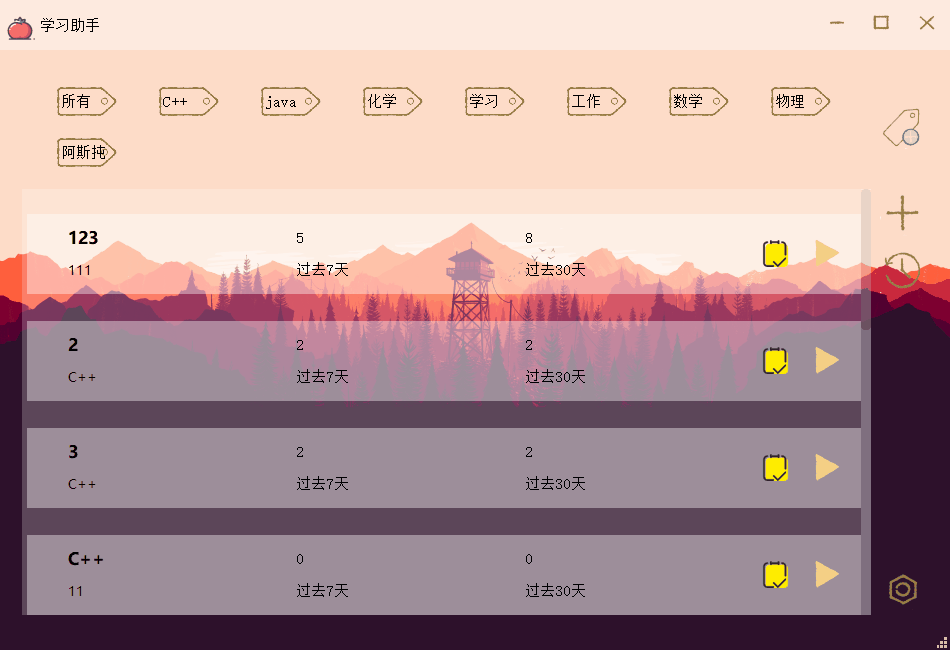
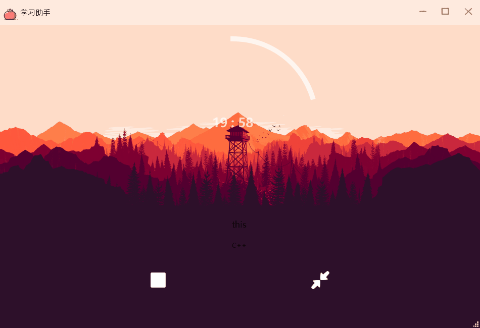
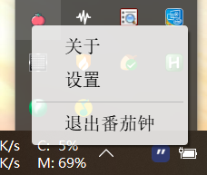

## 编译
### 需要组件
需要cmake和qt5(包括charts)已安装， 安装 ：
    推荐手动在Qt官网下载Qt安装包并选择安装gcc版本的qt prebuilds，便于之后选择cmake路径。
### 编译
```
mkdir build && cd build
cmake .. -DQt5_DIR=<your qt install dir>
```
需要手动添加Qt的安装路径，如果你的环境变量设置好了也也可以不用加上这个选项。For my example:
`-DQt5_DIR=/home/user/Qt5.12.6/5.12.6/gcc_64/lib/cmake/Qt5`
    
## 贡献代码
欢迎PR
- 最好使用这个项目的clang-format格式化代码样式。
- 文件编码最好使用utf-8 with bom，不然Vistual Studio编译的时候中文部分会有错误。

## 屏幕截图

- 开始使用: 



- 中断番茄钟, 以及图表显示:




- 翻译:


- 托盘菜单:



